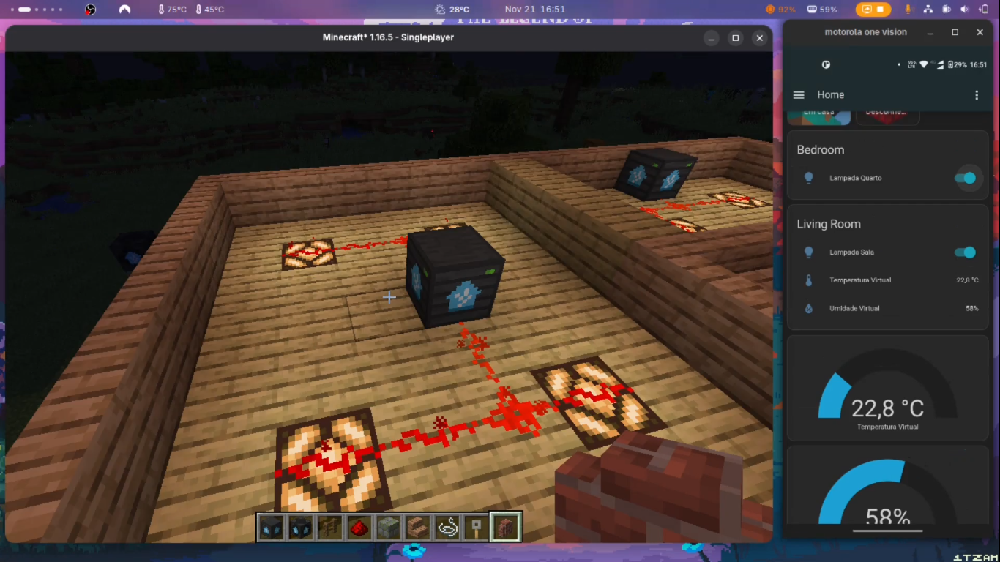
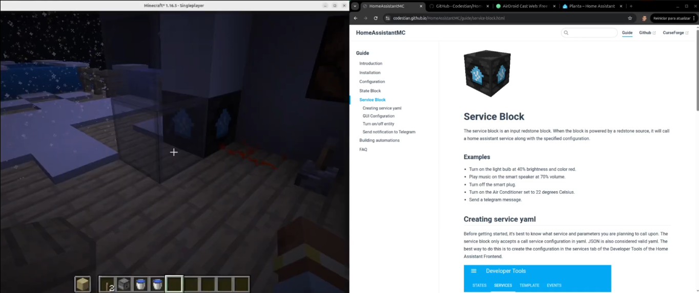

<h1 align = "center">
    Atividade Avaliativa III - Tecnologias de Comunicação para IoT
</h1>

**Aluno:** José Manoel Freitas da Silva

<p align ="center">
<a href= "#sobre-este-projeto">🕹️ Sobre este projeto</a> &nbsp;&nbsp;&nbsp;|&nbsp;&nbsp;&nbsp;
<a href = "#consideracoes">📚 Considerações</a>  &nbsp;&nbsp;&nbsp;|&nbsp;&nbsp;&nbsp;
<a href="#licenca">📝 Licença</a>
</p>

<hr>

<h2 id = "sobre-este-projeto">🕹️ Sobre este projeto</h2>

Esse projeto consiste na implementação do [Home Assistant](https://www.home-assistant.io/) para automação de uma casa construída no ambiente virtual do [Minecraft](https://www.minecraft.net/pt-br). Para a automação, foi utilizado o mod **[HomeAssistantMC](https://codestian.github.io/HomeAssistantMC/guide/)**, que realiza a integração entre o jogo e o Home Assistant via [WebSocket](https://developers.home-assistant.io/docs/api/websocket/).

Para instalar o Home Assistant, siga as instruções disponíveis na [documentação](https://www.home-assistant.io/installation/).

**Vídeo de demonstração:**

[](https://youtu.be/FsNvzliUn4U)

O mod, que está disponível no [CurseForge](https://www.curseforge.com/minecraft/mc-mods/homeassistantmc), disponibiliza dois blocos:

| [State Block](https://codestian.github.io/HomeAssistantMC/guide/state-block.html)| [Service Block](https://codestian.github.io/HomeAssistantMC/guide/service-block.html)                 |
|--------------------------|--------------------------------|
| |  |
| Responsável por receber os inputs do HA | Responsável por acionar serviços do HA |


Ambos podem ser utilizados em qualquer estrutura feita de [redstone](https://minecraft.wiki/w/Redstone_circuits) e em conjunto com outros mods.

***

### Utilização

Para a execução dos scripts de automação e simulação, é necessário configurar o ambiente Node.js. Instale o NVM e o [Node.js](https://nodejs.org/pt/download) com os comandos abaixo:

```bash
curl -o- https://raw.githubusercontent.com/nvm-sh/nvm/v0.40.2/install.sh | bash

\. "$HOME/.nvm/nvm.sh"

nvm install 24
```

#### Instalando as dependências do projeto

Acesse o diretório onde os scripts estão localizados e instale as bibliotecas JavaScript necessárias: **[whatsapp-web.js](https://wwebjs.dev/guide/installation.html)**, **qrcode-terminal** e **mqtt**).

Exemplo:

```bash
npm init -y
npm install whatsapp-web.js qrcode-terminal mqtt
```

> Lembre-se de alterar o usuário, senha e endereço do mqtt!

#### Executando os bots

Para iniciar a integração, execute o arquivo **index.js**. Na primeira execução, será gerado um QR Code no terminal que deve ser escaneado pelo seu aplicativo do WhatsApp (Menu \> Aparelhos Conectados \> Conectar um aparelho).

```bash
node index.js
```

Aguarde a mensagem "Cliente WhatsApp está pronto\!" e a confirmação do ID detectado para garantir que o bot está operante.


Para validar o dashboard sem sensores físicos, execute o script **sensores.js** em um terminal separado. Ele enviará dados aleatórios de temperatura e umidade via MQTT a cada 5 segundos.

```bash
node sensores.js
```

***
<h2 id = "consideracoes">📚 Considerações</h2>

Inicialmente, eu fiz essa atividade como uma forma de descontrair no fim do semestre. 

Normalmente, os trabalhos do Instituto Metrópole Digital têm um apelo muito forte para a área comercial, com frases como **"por que o seu cliente gostaria disso?"** para direcionar os alunos. Quando vi um **"use a criatividade"**, encontrei a oportunidade perfeita de fugir um pouco desse ar corporativo.

Eu não sou completamente contra a abordagem do IMD de incentivar a criação de startups, ainda mais considerando a sua incubadora, mas, do meu ponto de vista, esse discurso acaba empobrecendo o estudante, que poderia estar fazendo algo mais útil que entrar para o grupo de donos de Jeep Renegade, como contribuir para o open source ou entrar para projetos de pesquisa. 

Encontrar professores que incentivam esse outro lado da vida acadêmica sempre me deixa muito feliz e fico ainda mais feliz que tenham gostado da minha "brincadeira" fora do comum, usando o Minecraft como plataforma de desenvolvimento.

O meu professor, [Ramon Fontes](https://github.com/ramonfontes), acabou criando uma versão mais encorpada que cria uma cópia virtual da sua casa no Minecraft em conjunto com o HomeAssistantMC, de modo que é possível controlar itens da casa a partir do digital twin em game.  Eu  recomendo que vejam o video a seguir:

**Demonstração feita por Ramon Fontes**

[](https://youtu.be/FsNvzliUn4U)


Espero conseguir pagar outras matérias assim nos próximos semestres.
***

<h2 id="licenca">📝 Licença</h2>

- Este projeto está sob a licença [MIT](https://github.com/JosManoel/Con2IoT-2025.2-BTI-UFRN/blob/main/LICENSE).

<hr>

<div align = "center">
  
  👋🏾 Feito por [JosManoel](https://github.com/JosManoel) com 🕹️ , 🎧 e 💻.
</div> 